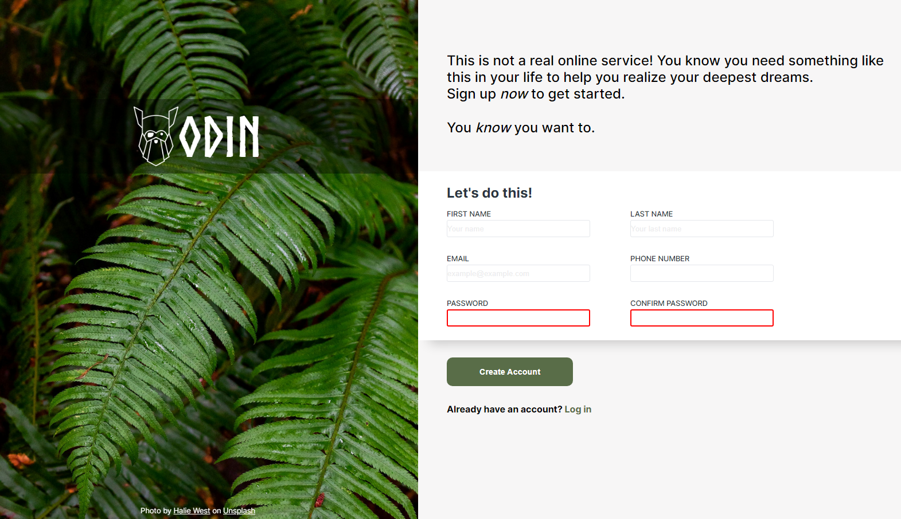

# Sign-Up Form

This project is part of the [The Odin Project](https://www.theodinproject.com) curriculum and aims to create a functional and aesthetically pleasing sign-up form using HTML and CSS. The form simulates a sign-up page for a fictional service and includes validations to ensure correct user input.

## Overview

The sign-up form includes the following fields:

- Username
- Email
- Phone Number
- Password
- Password Confirmation

Each field has specific validations to ensure that the data is entered correctly.

## Features

- **Email Validation**: Ensures that the entered email is in a valid format.
- **Password Validation**: Passwords must be at least 6 characters long.
- **Phone Number Validation**: Ensures that the phone number is in the correct format.

## Technologies Used

- **HTML5**: For the structure of the form.
- **CSS3**: For styling and layout of the form.

## Screenshots

# Formulário de Cadastro

Este projeto faz parte do currículo do [The Odin Project](https://www.theodinproject.com) e tem como objetivo criar um formulário de cadastro funcional e esteticamente agradável utilizando HTML e CSS. O formulário simula a página de cadastro de um serviço fictício e inclui validações para garantir a entrada correta dos dados do usuário.

## Visão Geral

O formulário de cadastro inclui os seguintes campos:

- Nome de Usuário
- Email
- Número de Telefone
- Senha
- Confirmação de Senha

Cada campo possui validações específicas para garantir que os dados sejam inseridos corretamente.

## Funcionalidades

- **Validação de Email**: Garante que o email inserido esteja em um formato válido.
- **Validação de Senha**: As senhas devem ter pelo menos 6 caracteres.
- **Validação de Número de Telefone**: Garante que o número de telefone esteja no formato correto.

## Tecnologias Utilizadas

- **HTML5**: Para a estrutura do formulário.
- **CSS3**: Para o estilo e layout do formulário.
